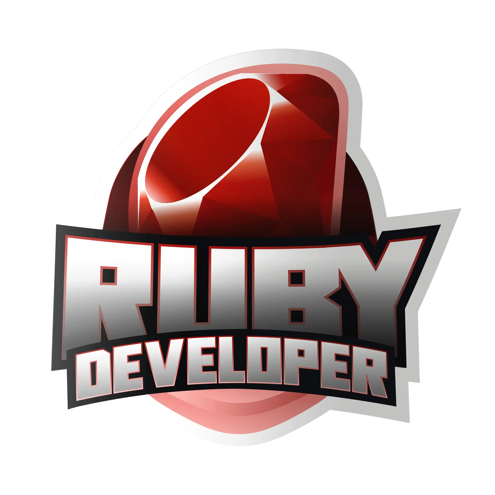

# Formação Ruby Developer

  

## Sobre o repositório
Este repositório guarda os códigos solicitados durante o Curso: Formação Ruby Developer - DIO.

## Linguagem Ruby 
Ruby é uma linguagem de programação dinâmica, interpretada e de código aberto, com foco na simplicidade e produtividade. Ela tem uma sintaxe elegante que é natural de ler e fácil de escrever. 
Para mais informações, visite a [página oficial](https://www.ruby-lang.org/pt/).

## Sobre o curso
O curso é encontrado na plataforma da DIO e segundo a empresa, durante a Formação, você irá conhecer o surgimento dessa linguagem, entender como é fácil criar e manipular seus códigos, afinal esse foi o propósito de sua criação, além de ver na prática a POO aplicada a Ruby, trabalhar com APIs, arquitetura MVC e claro, conhecer o famoso framework Ruby on Rails. 

##

  <b>Para mais informações, visite:</b> 
   

